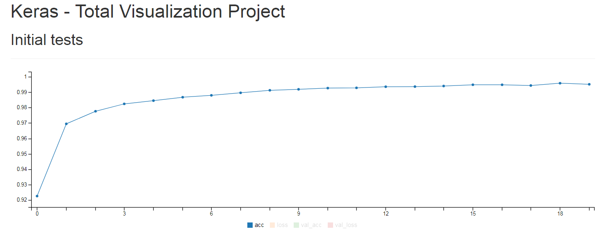

# Hualos - 在Keras中動態監視training過程
Keras本身就有提供`callbacks`機制，可以讓我們在training過程中，看到一些資訊。

這邊要教如何使用`Hualos`，讓我們在Web上看到training時的acc、loss等變化。

## 使用RemoteMonitor
我們可以直接用`callbacks.RemoteMonitor()`將training時的acc、loss、val_acc、val_loss，POST到我們的Server上。

```python
from keras import callbacks
remote = callbacks.RemoteMonitor(root='http://localhost:9000')

model.fit(X_train, Y_train, batch_size=batch_size, nb_epoch=nb_epoch, validation_data=(X_test, Y_test), callbacks=[remote])
```

當然網頁要自己寫太麻煩了，這邊使用`Hualos`來替我們完成。

## 安裝Hualos所需套件
由於`Hualos`需要用到以下兩個Python套件，可以透過`pip`直接安裝
* Flask
* gevent

```
$ pip install flask gevent
```

## 下載Hualos
```
$ git clone https://github.com/fchollet/hualos.git
```

## 執行Hualos
```
$ python hualos/api.py
```

開啟瀏覽器，進入`localhost:9000`

## Training
使用`mnist`為範例，完整程式碼如下

```python
import keras
from keras.datasets import mnist
from keras.models import Sequential
from keras.layers import Dense, Dropout
from keras.optimizers import RMSprop
from keras import callbacks

batch_size = 128
num_classes = 10
epochs = 20

(x_train, y_train), (x_test, y_test) = mnist.load_data()

x_train = x_train.reshape(60000, 784)
x_test = x_test.reshape(10000, 784)
x_train = x_train.astype('float32')
x_test = x_test.astype('float32')
x_train /= 255
x_test /= 255
print(x_train.shape[0], 'train samples')
print(x_test.shape[0], 'test samples')

y_train = keras.utils.to_categorical(y_train, num_classes)
y_test = keras.utils.to_categorical(y_test, num_classes)

model = Sequential()
model.add(Dense(512, activation='relu', input_shape=(784,)))
model.add(Dropout(0.2))
model.add(Dense(512, activation='relu'))
model.add(Dropout(0.2))
model.add(Dense(num_classes, activation='softmax'))

model.summary()

model.compile(loss='categorical_crossentropy',
              optimizer=RMSprop(),
              metrics=['accuracy'])

remote = callbacks.RemoteMonitor(root='http://localhost:9000')

model.fit(x_train, y_train,
          batch_size=batch_size,
          epochs=epochs,
          verbose=1,
          validation_data=(x_test, y_test),
          callbacks=[remote])

score = model.evaluate(x_test, y_test, verbose=0)

print('Test loss:', score[0])
print('Test accuracy:', score[1])
```

回到網頁就能即時看到training時的acc、loss、val_acc、val_loss。



## 參考
https://github.com/fchollet/hualos

